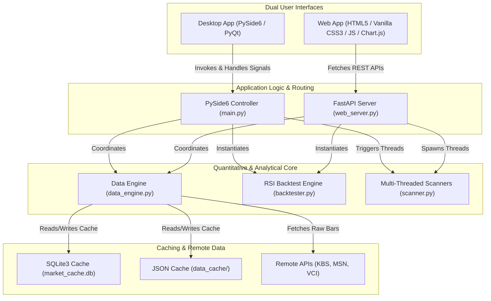

# VNStock Premium TA Suite - Codebase Index & Architecture Blueprints

Welcome to the comprehensive architectural and functional blueprint of the **VNStock Premium TA Suite**. This document serves as a high-fidelity codebase index, tracing the interactions, algorithms, database schemas, multi-threaded systems, and dual interfaces (Desktop App & Web App) that power the application.

---

## 1. System Architecture Diagram

The system operates on a highly decoupled **three-tier architecture** with dual interface layers sharing a common Technical Analysis & Data engine core:



---

## 2. Directory Structure & Files Overview

The codebase is organized as follows:

| Filename | Purpose | Key Classes & Functions | Length |
| :--- | :--- | :--- | :--- |
| [`data_engine.py`](file:///i:/back%20test%20vn/data_engine.py) | High-fidelity financial data ingestion, caching, and rate limiting | `RateLimiter`, `DataEngine`, `get_history()` | ~530 lines |
| [`backtester.py`](file:///i:/back%20test%20vn/backtester.py) | Quantitative backtesting engine for RSI strategies with SL/TP | `Backtester`, `run_backtest()`, metric calculators | ~350 lines |
| [`scanner.py`](file:///i:/back%20test%20vn/scanner.py) | Desktop thread-based scanning logic for VN302 market list | `ScannerThread`, `AntigravityThread`, `WatchlistThread` | ~450 lines |
| [`ui_main.py`](file:///i:/back%20test%20vn/ui_main.py) | PySide6 Desktop GUI layout, custom charting, and neon styling | `CandlestickItem`, `TechnicalChartWidget`, `Ui_MainWindow` | ~700 lines |
| [`main.py`](file:///i:/back%20test%20vn/main.py) | Main entry point and MVC Controller for the PySide6 Desktop application | `Controller`, `MainWindow`, `main()` | ~510 lines |
| [`web_server.py`](file:///i:/back%20test%20vn/web_server.py) | FastAPI backend web server exposing parallel analysis, downloads & crawlers | `AppState`, `run_scan_worker()`, REST routing, daemons | ~2190 lines |
| [`static/index.html`](file:///i:/back%20test%20vn/static/index.html) | Single Page Application (SPA) dashboard structured HTML layout | Tab elements, modals, responsive grid | ~770 lines |
| [`static/app.js`](file:///i:/back%20test%20vn/static/app.js) | SPA Client-side logic, Chart.js managers, dynamic polling | `loadLiquidityData()`, `loadMarketCapData()`, chart renders | ~2260 lines |
| [`static/style.css`](file:///i:/back%20test%20vn/static/style.css) | Custom premium neon-dark theme glassmorphism style rules | `@keyframes`, variables, media queries | ~1100 lines |

---

## 3. Core Logic & Data Flow

### A. Data Ingestion & Cache Policies ([data_engine.py](file:///i:/back%20test%20vn/data_engine.py))
*   **API Sources**: The engine supports three APIs: **KBS (KB Securities)**, **MSN (Masan Feed)**, and **VCI (Vietcap)**.
*   **Throttling**: The `RateLimiter` enforces safe latency intervals (minimum `0.3` to `2.5` seconds depending on the source) to prevent IP blocking.
*   **Composite Caching**:
    *   **Level 1 (Memory Cache)**: Simple dictionary cache inside `DataEngine` to keep loaded data frames active.
    *   **Level 2 (File Cache)**: `data_cache/{symbol}_{start}_{end}.json` containing serialized raw bars.
    *   **Level 3 (Relational Cache)**: SQLite database (`market_cache.db`) table `historical_prices` that stores parsed historical OHLCV data.
*   **Data Scaling**: Automatic adjustment of close prices: if prices from the API are unscaled (e.g., standard price `34.5` instead of `34500`), the engine dynamically scales them to absolute VND values.

### B. SQLite Database Schemas ([web_server.py](file:///i:/back%20test%20vn/web_server.py))
The application maintains three core caching tables inside `market_cache.db`:

#### 1. `historical_prices`
Stores the daily historical data for all 302 symbols.
```sql
CREATE TABLE IF NOT EXISTS historical_prices (
    symbol TEXT,
    time TEXT,
    open REAL,
    high REAL,
    low REAL,
    close REAL,
    volume INTEGER,
    PRIMARY KEY (symbol, time)
)
```

#### 2. `daily_liquidity`
Stores calculated absolute daily trading values for instant sub-millisecond retrieval.
```sql
CREATE TABLE IF NOT EXISTS daily_liquidity (
    date TEXT,
    symbol TEXT,
    close REAL,
    volume INTEGER,
    liquidity_vnd INTEGER,
    industry TEXT,
    PRIMARY KEY (date, symbol)
)
```

#### 3. `ticker_shares`
Stores compiled outstanding shares of all VN302 symbols for instant market-cap calculations.
```sql
CREATE TABLE IF NOT EXISTS ticker_shares (
    symbol TEXT PRIMARY KEY,
    outstanding_shares INTEGER
)
```

---

## 4. Quantitative Strategy Backtest Engine

The RSI Backtest Engine (`backtester.py`) evaluates historical performance metrics using daily bar resolution.

### A. Core RSI Strategy Flow
1.  **Technical indicator setup**: Calculates a 14-period standard Relative Strength Index (RSI).
2.  **Buy Trigger (Entry)**: Executed when the RSI crosses below the `buy_threshold` (default `30.0`), and no position is currently open.
3.  **Position Sizing**: Allocates a percentage of current equity (default `100.0%`) to purchase shares at the close price of the trigger day.
4.  **Sell Trigger (Exit)**: Executed at the close of the day when **any** of the following conditions are met:
    *   **RSI Exit**: RSI crosses above the `sell_threshold` (default `70.0`).
    *   **Stop Loss (SL)**: Close price drops below the purchase price by a set percentage (e.g., `7.0%`).
    *   **Take Profit (TP)**: Close price exceeds the purchase price by a set percentage.

### B. Mathematical Quantitative Metrics
The backtest yields professional performance indicators calculated using pandas & numpy:

*   **CAGR (Compound Annual Growth Rate)**:
    $$\text{CAGR} = \left( \frac{\text{Final Equity}}{\text{Initial Capital}} \right)^{\frac{365}{\text{Total Days}}} - 1$$
*   **Daily Return ($R_d$)**:
    $$R_d = \frac{E_d}{E_{d-1}} - 1$$
*   **Sharpe Ratio (Annualized)**:
    $$\text{Sharpe} = \sqrt{252} \times \frac{\text{Mean}(R_d) - R_f}{\text{StdDev}(R_d)}$$
    *(where $R_f = 0.04$ is the risk-free rate assumption)*
*   **Sortino Ratio (Annualized)**:
    $$\text{Sortino} = \sqrt{252} \times \frac{\text{Mean}(R_d) - R_f}{\text{StdDev}(R_{d,\text{negative}})}$$
    *(where $R_{d,\text{negative}}$ represents only daily returns less than zero)*
*   **Drawdown ($DD$)**:
    $$DD_d = \frac{E_d}{\max_{i \le d}(E_i)} - 1$$
*   **Profit Factor**:
    $$\text{Profit Factor} = \frac{\sum(\text{Profits from Winning Trades})}{\sum(\text{Losses from Losing Trades})}$$
*   **Expectancy**:
    $$\text{Expectancy} = (\text{Win Rate} \times \text{Average Win}) - ((1 - \text{Win Rate}) \times \text{Average Loss})$$

---

## 5. Dual Multi-Threaded Scanner System

Scanning 302 symbols across long historical durations is highly compute-intensive. To prevent UI lockups and connection throttling, the system uses dual multi-threaded systems depending on the interface:

### A. Desktop Multi-Threading Architecture ([scanner.py](file:///i:/back%20test%20vn/scanner.py))
Uses PySide6 **`QThread`** coupled with custom progress signals and sequential queues:

```
               [ Main Controller / UI Thread ]
                             |
             Spawns & connects signals to UI elements
                             |
             v---------------------------------v
     [ ScannerThread ]               [ AntigravityThread ]
    Processes market breadth         Processes historical setups
    & technical status in            using sliding search windows
    8 parallel standard threads.     in background execution.
```

### B. Web Backend Multi-Threading Architecture ([web_server.py](file:///i:/back%20test%20vn/web_server.py))
Uses FastAPI **`BackgroundTasks`** coupled with a thread-safe global `AppState` container utilizing `threading.Lock()` controls:

```
                [ HTTP POST /api/scan/start ]
                             |
         Spawns worker using FastAPI BackgroundTasks
                             |
           [ Lock State block: running = True ]
                             |
           Enqueues all tickers into queue.Queue()
                             |
         Spawns 8 thread-safe worker threads
                             |
          v------------------v------------------v
      [ Worker 1 ]       [ Worker 2 ]  ...  [ Worker 8 ]
      Pulls ticker       Pulls ticker       Pulls ticker
      Runs indicators    Runs indicators    Runs indicators
      Appends results    Appends results    Appends results
          |                  |                  |
          o------------------o------------------o
                             |
         Increments current count, updates progress %
                             |
        [ Lock State block: running = False, prog = 100% ]
```

---

## 6. Algorithmic Strategy Formulations

### A. Antigravity Volatility Strategy
Designed to detect explosive setups by identifying extended sideways consolidation with severe volume depletion followed by a volume-and-price breakout spike:

#### 1. Setup Phase (Last 5 Sessions)
*   **Volume Depletion Rule**: Absolute daily volume is less than its 20-day moving average volume ($V_{MA20}$) for at least 5 consecutive trading days:
    $$\prod_{t=-5}^{-1} \mathbb{I}\left( V_t < V_{MA20, t} \right) = 1$$
*   **Price Sideways Consolidation Rule**: The maximum price range over the 5 sessions must be tightly squeezed within a $4\%$ band:
    $$\frac{\max(Close_{-5:-1}) - \min(Close_{-5:-1})}{\min(Close_{-5:-1})} \le 0.04$$

#### 2. Trigger Phase (Current Session)
Executed when a massive breakout occurs on the current session ($t=0$):
*   **Volume Spike**: Current volume is at least $1.5\times$ the 20-day MA volume:
    $$V_0 \ge 1.5 \times V_{MA20, 0}$$
*   **Price Breakout**: Current session returns a gain of $\ge 3\%$:
    $$\frac{Close_0 - Close_{-1}}{Close_{-1}} \ge 0.03$$

### B. Watchlist Consolidation Strategy
Tracks stocks in an active, tight consolidation phase before a breakout has triggered:
*   **Timeframe**: The last 5 consecutive trading days.
*   **Volume constraint**: Daily volume remains strictly below $V_{MA20}$.
*   **Price constraint**: Squeezed within a tight $6\%$ Darvas-style box:
    $$\frac{\max(High_{-5:0}) - \min(Low_{-5:0})}{\min(Low_{-5:0})} \le 0.06$$

---

## 7. Web REST Endpoints & Route Mappings

The FastAPI server (`web_server.py`) exposes several endpoints categorized as follows:

### A. Core Engine & Source
*   `POST /api/source` - Configures the active data source (`KBS`, `MSN`, `VCI`) and instantiates a new `DataEngine`.
*   `GET /api/tickers` - Returns the complete list of VN302 symbols.
*   `GET /api/history/{symbol}` - Fetches and returns historical close prices and MA50 values.

### B. Quantitative Testing
*   `POST /api/backtest` - Executes a multi-threaded RSI backtest on a single symbol and returns trades log, metrics, and equity curve array.

### C. Technical Scanners
*   `POST /api/scan/start` - Launches the background technical indicator scanner thread.
*   `POST /api/scan/stop` - Terminates the technical scanner.
*   `GET /api/scan/status` - Returns active scanner stats (progress %, completed counts).
*   `GET /api/scan/results` - Retrieves calculated technical values.

### D. Advanced Strategies
*   `POST /api/antigravity/start` - Starts scanning historical Antigravity signals.
*   `GET /api/antigravity/results` - Retrieves Antigravity signals and win rates.
*   `POST /api/watchlist/start` - Starts scanning currently consolidating stocks.
*   `GET /api/watchlist/results` - Retrieves the watchlist stocks.

### E. Market Analysis & Sectors
*   `GET /api/heatmap` - Yields average sectors performance and MA50 breadth percentages.
*   `GET /api/market-analysis` - Exposes sector-wide metrics relative to the VN-Index.

### F. Liquidity Systems
*   `POST /api/liquidity/start` - Starts compiling matching values of all VN302 stocks on a specific session.
*   `GET /api/liquidity/results` - Returns compiled daily liquidity matching values.
*   `POST /api/sync/start` - Syncs historical price records for 302 tickers for the past 3 years to ensure instant database caching.

### G. Market Capitalization Systems
*   `POST /api/market-cap/start` - Processes company size valuations (Mega, Large, Mid, Small Cap).
*   `POST /api/market-cap-range/start` - Compiles daily total market caps and liquidities across a custom date range.
*   `GET /api/market-cap-range/results` - Yields tabular range outcomes and detailed sub-day metrics.

### H. Outstanding Shares Crawler Daemon
*   `GET /api/shares-crawler/status` - Checks outstanding shares retrieval progress.
*   `POST /api/shares-crawler/restart` - Resets crawled cache and forces a full re-crawl of company share statistics.

### I. Dynamic Document Exporters
Generates multi-sheet Microsoft Excel downloads on-the-fly:
*   `GET /api/export/scan` - Compiles technical metrics into a CSV tệp.
*   `GET /api/export/market` - Returns industry details relative to the VN-Index.
*   `GET /api/export/antigravity` - Generates Antigravity signal Excel logs.
*   `GET /api/export/watchlist` - Exports cạn kiệt vol watchlist sheets.
*   `GET /api/export/backtest` - Exports quantitative RSI trades ledger.
*   `GET /api/export/market-cap` - Exports sector and rank-based capitalizations.
*   `GET /api/export/market-cap-range` - Generates horizontal multi-sheet grouped range reports (Market Cap + Liquidity).

---

## 8. Premium Aesthetics & Design Tokens

Both desktop and web UI implementations follow a strict, visually striking **Dark Neon Glassmorphic design system**:

### A. Color Palette
```css
:root {
    --bg-darker: #0c0f14;       /* Primary screen background */
    --bg-card: rgba(18, 22, 29, 0.7); /* Translucent cards (Glassmorphism) */
    --accent-cyan: #00e5ff;     /* Primary neon blue glow */
    --accent-emerald: #26a69a;  /* Secondary bullish indicator green */
    --accent-red: #ef5350;      /* Warning / Bearish red */
    --accent-purple: #8a2be2;   /* Premium Antigravity violet */
    --border-glass: rgba(255, 255, 255, 0.08); /* Card borders */
}
```

### B. Visual Highlights
1.  **Typography**: Outfit & Inter Fonts imported from Google Fonts for a clean, modern aesthetic.
2.  **Backdrop Filter**: `backdrop-filter: blur(16px)` provides an elegant frosted-glass feel.
3.  **Neon Glows**: Dynamic box-shadow animations that light up based on market trend direction:
    ```css
    .glow-cyan { box-shadow: 0 0 15px rgba(0, 229, 255, 0.15); }
    .glow-purple { box-shadow: 0 0 15px rgba(138, 67, 226, 0.15); }
    .glow-emerald { box-shadow: 0 0 15px rgba(38, 166, 154, 0.15); }
    ```
4.  **Hover Micro-Animations**: Buttons and cards scale slightly and transition borders smoothly to enhance engagement.

---

## 9. Next Steps for Optimization & Feature Expansion

*   **Database Indexes**: Create composite indexes on `historical_prices(symbol, time)` to speed up multi-date queries.
*   **WebSockets Integration**: Replace HTTP polling of scanner status with WebSockets for real-time progress updates.
*   **Machine Learning Integration**: Add a forecasting model (e.g., ARIMA or LSTM) using the cleaned history from the `DataEngine` to display predictions directly on the Candlestick Modal charts.

---
*Created and maintained by the Advanced AI pairing system, May 2026.*
